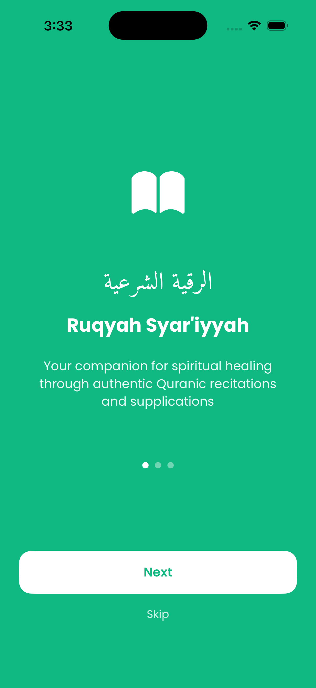
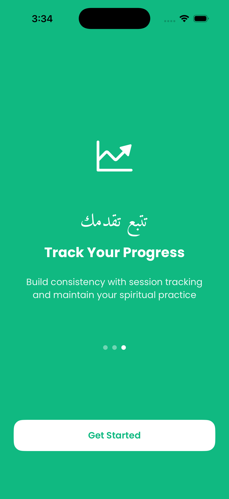
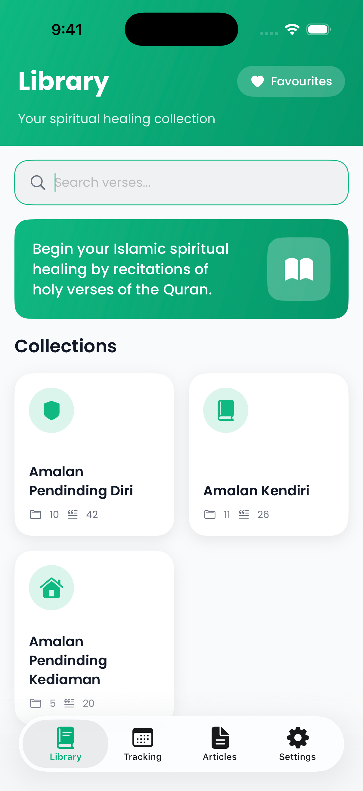
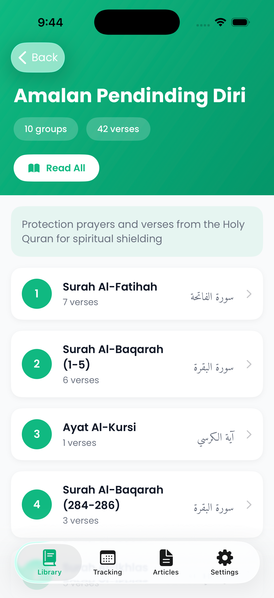
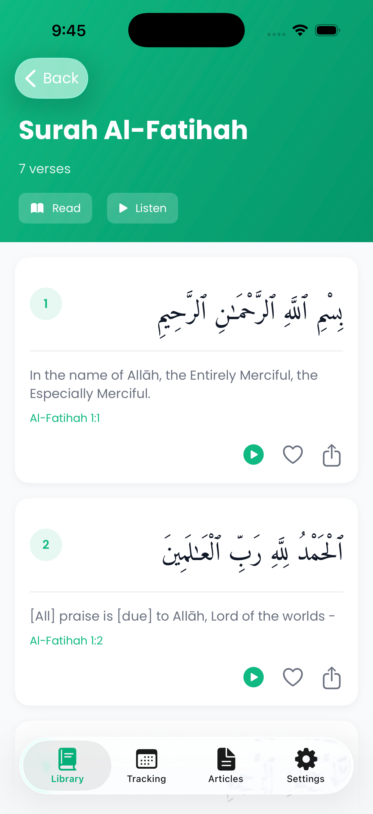
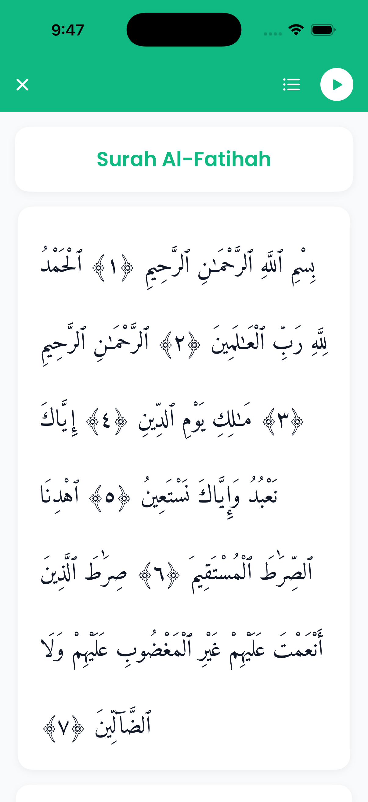
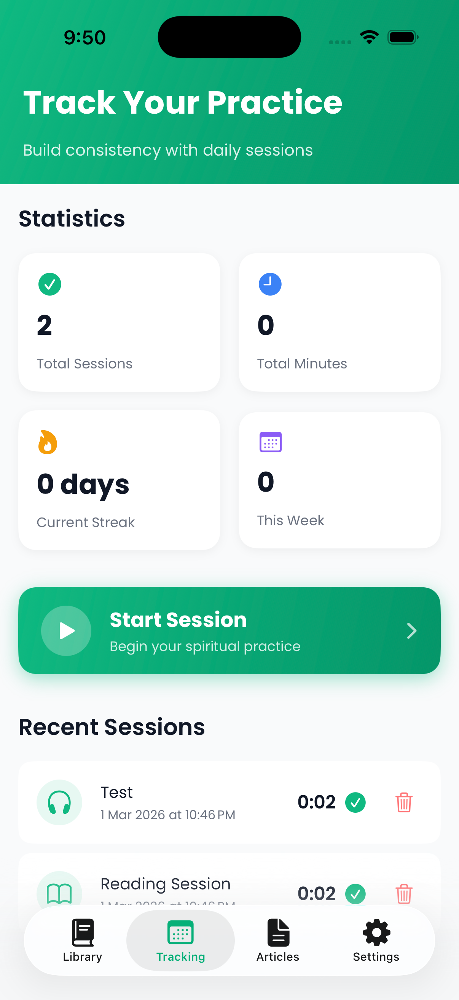
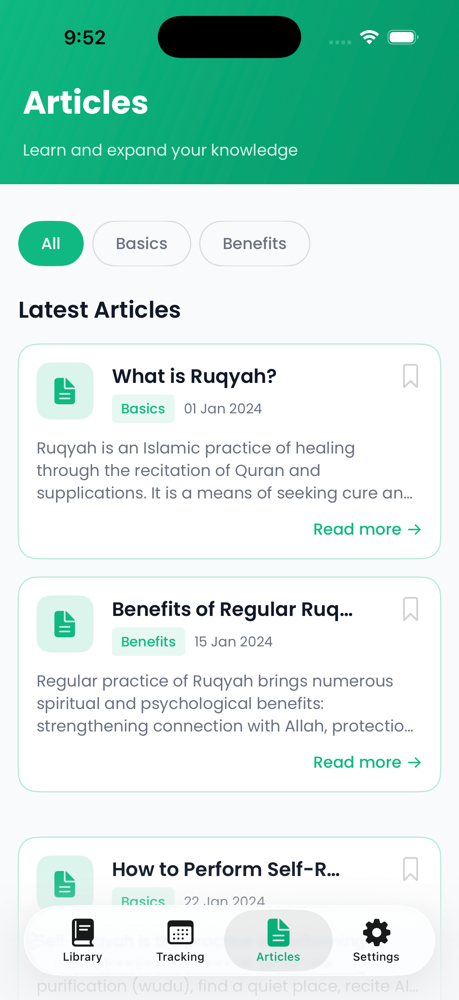

<p align="center">
  <i>بِسْمِ اللَّهِ الرَّحْمَٰنِ الرَّحِيمِ</i><br/>
  Dengan nama Allah, Yang Maha Pemurah, lagi Maha Mengasihani.
</p>

<h1></h1>

<p align="center">
  
</p>

Aplikasi pendamping penyembuhan rohani Islam melalui bacaan ayat-ayat Al-Quran dan doa-doa yang sahih.

## Demo

> *Video dipercepatkan (fast-forwarded) untuk tujuan demonstrasi.*

https://github.com/alia-abdrahman/ruqyah-syariyyah-app/raw/main/screenshots/demo.mp4

<p align="center">
  
  
</p>

## Pengenalan

**MyRuqyah** ialah aplikasi iOS yang direka khas untuk membantu umat Islam mengamalkan ruqyah syar'iyyah secara kendiri. Aplikasi ini menyediakan koleksi lengkap ayat-ayat Al-Quran, doa-doa perlindungan, dan zikir yang disusun mengikut tujuan amalan — sama ada untuk perlindungan diri, penyembuhan kendiri, atau perlindungan kediaman.

Dibangunkan sepenuhnya menggunakan **SwiftUI** dan **SwiftData** secara native iOS, tanpa sebarang kebergantungan luaran (third-party dependencies).

## Fungsi & Ciri-ciri Utama

### 1. Perpustakaan Koleksi Ruqyah

Koleksi bacaan ruqyah yang disusun dalam 3 kategori utama:

- **Amalan Pendinding Diri** — 10 kumpulan, 42 ayat perlindungan peribadi
- **Amalan Kendiri** — 11 kumpulan, 26 ayat amalan penyembuhan kendiri
- **Amalan Pendinding Kediaman** — 5 kumpulan, 20 ayat perlindungan rumah

<p align="center">
  
  
</p>

### 2. Paparan Ayat dengan Teks Arab & Terjemahan

- Teks Arab Al-Quran dengan font **Amiri Quran** yang indah
- Terjemahan Bahasa Inggeris dan Bahasa Melayu
- Rujukan surah dan nombor ayat
- Saiz teks Arab boleh dilaraskan (20pt - 40pt)

<p align="center">
  
  
</p>

### 3. Audio Al-Quran

- Strim audio bacaan dari **API Quran.com**
- Kawalan main, jeda, dan langkau 10 saat
- Pelarasan kelajuan bacaan (0.5x hingga 2.0x)
- Pemain mini (mini player) di bawah skrin
- Sokongan senarai main (playlist) dengan butang seterusnya/sebelumnya

### 4. Penjejakan Amalan (Tracking)

- Jejak sesi amalan harian dengan pemasa (timer)
- 3 jenis sesi: Audio, Bacaan, dan Tersuai
- Papan pemuka statistik:
  - Jumlah sesi
  - Jumlah minit
  - Streak semasa (hari berturut-turut)
  - Sesi minggu ini
- Sejarah sesi terkini

<p align="center">
  
</p>

### 5. Artikel Pendidikan

- Artikel berkaitan ruqyah dan penyembuhan rohani Islam
- Penapisan mengikut kategori (Basics, Benefits)
- Fungsi carian dan penanda buku (bookmark)

<p align="center">
  
</p>

### 6. Ciri-ciri Tambahan

| Ciri | Penerangan |
|------|------------|
| Carian Global | Cari merentasi ayat, surah, dan koleksi |
| Kegemaran (Favourites) | Tandai ayat kegemaran untuk akses pantas |
| Mod Gelap/Cerah | Sokongan tema sistem, cerah, dan gelap |
| Dwibahasa | Antara muka dalam Bahasa Inggeris & Bahasa Melayu |
| Peringatan Harian | Notifikasi peringatan amalan harian |
| Paparan Mushaf | Mod bacaan skrin penuh untuk bacaan berfokus |

## Teknologi

| Komponen | Teknologi |
|----------|-----------|
| Bahasa Pengaturcaraan | Swift |
| UI Framework | SwiftUI |
| Penyimpanan Data | SwiftData |
| Audio | AVFoundation + Quran.com API |
| Notifikasi | UserNotifications |
| Seni Bina | MVVM (Model-View-ViewModel) |
| Font Arab | Amiri Quran |
| Font UI | Poppins |
| Platform | iOS 18+ |

## Struktur Projek

```
MyRuqyah/
├── App/                  # Entry point aplikasi
├── Models/               # Model data (Verse, Collection, Session, Article)
├── ViewModels/           # Logik perniagaan (Content, Tracking, Audio, Settings)
├── Views/                # Komponen UI (Library, Tracking, Articles, Settings)
├── Services/             # Perkhidmatan (DataLoader, Audio, Storage, Notification)
├── Data/verses/          # 29 fail JSON data ayat & koleksi
├── Resources/Fonts/      # Font Poppins & Amiri Quran
└── Assets.xcassets/      # Ikon & warna tema
```

## Cara Memasang (Installation)

1. Clone repositori ini
2. Buka fail `.xcodeproj` dalam Xcode
3. Pilih simulator atau peranti iOS
4. Tekan **Run** (Cmd + R)

> Tiada kebergantungan luaran (pod/SPM) diperlukan.

## Pasukan

Dibangunkan untuk **Hackathon GodamSahur 2026**.

---
